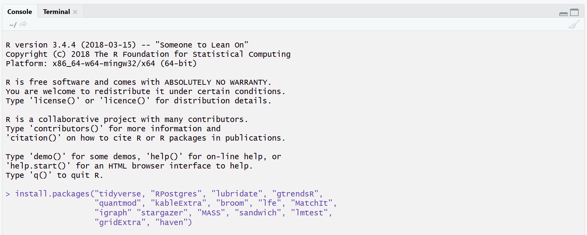

# EmpAccDataTut

## Content

This repo contains the R tutorial material that is used in the masters course on empirical research in Accounting, Auditing, and Analysis. (Once I get around to actually fill it that is) The tutorial sessions complement the paper discussions. It has two main parts: Learning how to wrangle typical financial data with R and doing standard empirical tests using R. We will not go into the details of things like causal inference. There are other courses for that. Instead, these sessions are intended to practice with you the important and time consuming craft of data wrangling.

Why R? Python might be a nicer language and Julia might be more performant. And I prefer Python for textual analysis, even though you can now do a lot of textual analysis in R too. But R has the best overall ecosystem for new researchers. It is the only language in my opinion that really covers all bases well: Data work, statistical procedures, simplifying the paper writing and results presentation process. And it's free. That's why I settled on R as the first language for master students.

## Usage of this repo

This material is intended to be simple, introductory teaching material for master students. Still, if the code in here is useful for your research or teaching, by all means use it. If you have time, drop me a line and let me know what you used it for. Of course, if there are bugs or more elegant ways of doing something, let me know and I will incorporate it; I am always keen on improving my coding.

## R and RStudio set up instructions

### R and RStudio

1. Download and install R from CRAN, [the Comprehensive R Archive Network](https://www.r-project.org/). definitely install a precompiled binary distribution for your operating system. Click on the *download R* link, download, then install the right version for your operating system.

2. Install RStudio's IDE (stands for integrated development environment) [link here](http://www.rstudio.com/ide/download/) 

### R packages used in these sessions

We will use quite a few different R packages in the tutorial sessions. To install the necessary packages run the following command from inside RStudio's console:

    install.packages(c("tidyverse", "RPostgres", "lubridate", "gtrendsR",
                       "quantmod", "kableExtra", "broom", "lfe", "MatchIt",
                       "igraph", "stargazer", "MASS", "sandwich", "lmtest",
                       "gridExtra", "haven"))

see below:

## Data used in these sessions

Due to university-bound data licensing stuff, I don't have no data included in the repo. I will make the data accessible only to LMU course participants a few days before the first class.